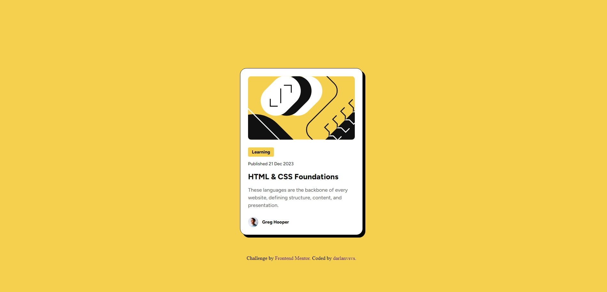

# Frontend Mentor - Blog preview card solution

This is a solution to the [Blog preview card challenge on Frontend Mentor](https://www.frontendmentor.io/challenges/blog-preview-card-ckPaj01IcS). Frontend Mentor challenges help you improve your coding skills by building realistic projects. 

## Table of contents

- [Overview](#overview)
  - [The challenge](#the-challenge)
  - [Screenshot](#screenshot)
  - [Links](#links)
- [My process](#my-process)
  - [Built with](#built-with)
  - [What I learned](#what-i-learned)
  - [Continued development](#continued-development)
  - [Useful resources](#useful-resources)
- [Author](#author)
- [Acknowledgments](#acknowledgments)

## Overview

### The challenge

Users should be able to:

- See hover and focus states for all interactive elements on the page

### Screenshot

### Links

- Solution URL: [https://github.com/darlanvsvs/frontendmentor_Blog_preview_card](https://github.com/darlanvsvs/frontendmentor_Blog_preview_card)
- Live Site URL: [https://darlanvsvs.github.io/frontendmentor_Blog_preview_card/](https://darlanvsvs.github.io/frontendmentor_Blog_preview_card/)

## My process

### Built with

- Semantic HTML5 markup
- CSS custom properties
- Flexbox

### What I learned

Learned how to change styles based on state.

To see how you can add code snippets, see below:

### Continued development

I want to pratice more css and HTML.

### Useful resources

-

## Author

- Website - [darlanvsvs](https://github.com/darlanvsvs)
- Frontend Mentor - [@darlanvsvs](https://www.frontendmentor.io/profile/darlanvsvs)

## Acknowledgments

-Try changing flex-direction to column.
